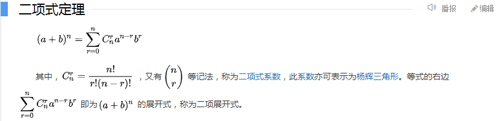

### 题目链接
https://leetcode-cn.com/problems/pascals-triangle-ii/

### 题目描述
题目难度：```简单```

给定一个非负索引 ```rowIndex``` ，返回「杨辉三角」的第 ```rowIndex``` 行。

在「杨辉三角」中，每个数是它左上方和右上方的数的和。


### 解题思路
1. 可以直接模拟
2. 也可以根据杨辉三角的性质来直接计算指定 *行* 的值：

   - 杨辉三角形的第 i 行的值依次为二项式 ```(a+b)^i``` 展开后的各项系数
    
   - 由此我们也可以得到一个递推式，```C(n,i+1) = C(n,i) * (n-i)/(i+1)``` 。

**1. 模拟：**
```python
# Python3
# Author: duzhenwei
class Solution:
    def getRow(self, rowIndex: int) -> List[int]:
        res = [1]
        for i in range(1, rowIndex + 1):
            row = [1]
            for i in range(len(res) - 1):
                row.append(res[i] + res[i + 1])
            row.append(1)
            res = row[: ]
        return res
```

**2. 直接计算第 rowIndex 行：**
```python
# Python3
# Author: duzhenwei
class Solution:
    def getRow(self, rowIndex: int) -> List[int]:
        res = [1]
        for i in range(rowIndex):
            res.append(res[-1] * (rowIndex - i) // (i + 1))
        return res
```